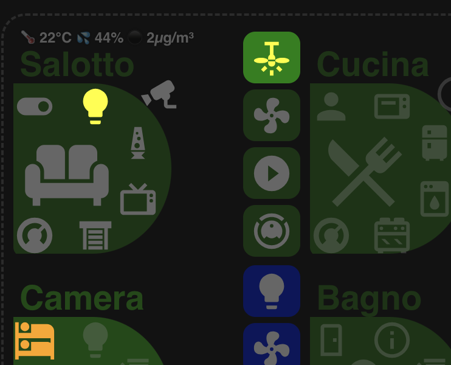
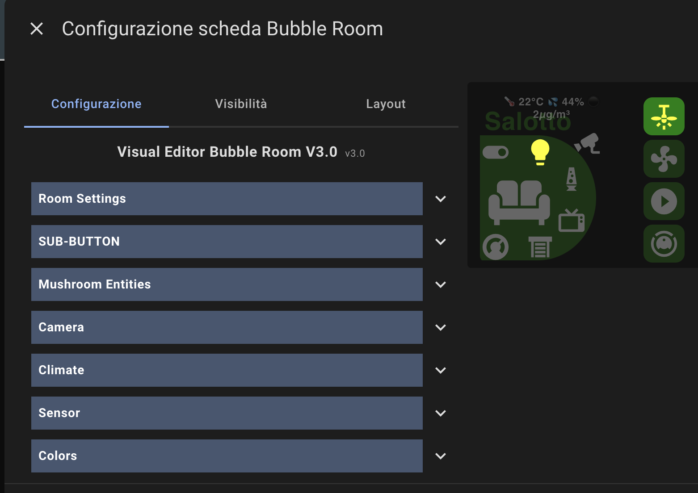

[](https://github.com/mon3y78/Lovelace-Bubble-room)
[](https://github.com/mon3y78/Lovelace-Bubble-room/stargazers)
[](https://community.home-assistant.io/t/bubble-room/856230?u=ipilla)
[](https://www.reddit.com/r/homeassistant/s/Qgz9acN7Mr)

# ✨ Bubble Room Card – v3.1 for Home Assistant
The Ultimate Visual Room Controller Card
Customizable, responsive, and made for Home Assistant power users!
Zero YAML required – everything is visual!

# 🚀 Main Features
Visual Editor Experience 🎨
Everything is configurable via a modern visual editor – no YAML needed! All options are split into intuitive sections:
Room Settings, Sub-Button, Mushroom Entities, Camera, Climate, Sensor, Colors.

### Room Settings 🏠
Set room name & main icon (icon-picker)
Configure tap/hold actions: navigate, toggle, more-info, call-service
Pick your presence entity (entity-picker)
### Sub-Buttons 🎛️
Up to 4 customizable sub-buttons per room
Each with independent entity (entity-picker), icon (icon-picker), and tap/hold actions
Complete color customization: active/inactive backgrounds & icons (with RGBA color pickers)
### Mushroom Entities 🍄
Up to 5 “bubble” entities around the main icon
Each can be assigned its own entity and icon
Perfect for quick-access devices, scenes, or extra info
### Camera Support 🎥
Add a camera entity with a dedicated icon and “mushroom” position
### Climate Control 🌡️
Native support for a climate/thermostat entity, with icon and actions
### Sensor Section 📊
Up to 4 sensors (temperature, humidity, CO₂, illuminance, PM, UV, noise, pressure, VOC, etc.)
Pick type, entity, and unit for each sensor
### Full Color Customization 🖌️
Visual color pickers for every color field (Room & Subbutton sections)
RGBA + transparency sliders for backgrounds, icons, mushroom states, and more
### Responsive & Adaptive Layouts 📱💻
Two layouts: 6x3 (compact) and 12x4 (expanded) for perfect display on tablets, dashboards, Nest Hub, and phones
Sub-buttons automatically expand to fit available space
### All via GUI Components 🧩
Uses ha-entity-picker for entities (with dynamic Home Assistant suggestions)
Uses ha-icon-picker for icons (MDI & custom icons)
No need to type YAML, ever!

# 🔥 Why Bubble Room 3.0?
Modern, modular, and highly flexible
Perfect for touch interfaces, tablets, and dashboards
Super fast to configure, fun to personalize

## Community & Support

For discussions, feedback and support, visit the official thread on the Home Assistant Community Forum:

🔗 [Bubble Room - Home Assistant Community](https://community.home-assistant.io/t/bubble-room/856230?u=ipilla)

# Installation
## Via HACS
1. Go to HACS > Frontend.
2. Click on "Explore & Add Repositories" and add the Bubble Room GitHub repository.
3. Install the card and add the following resource in Lovelace:
     ```yaml
   url: https://github.com/mon3y78/Lovelace-Bubble-room
   type: dashboard
