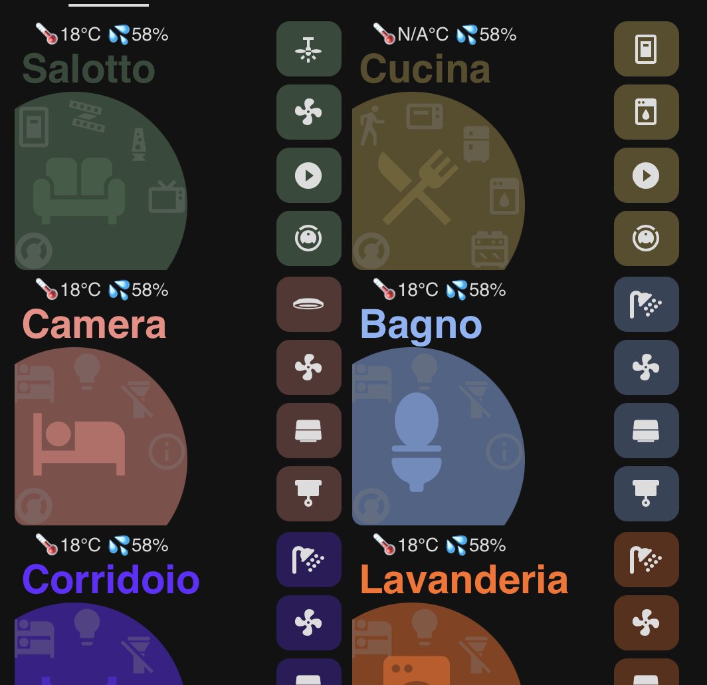

# Bubble Room Card
Bubble Room Card is a Lovelace card for Home Assistant based on the solid principles of the Bubble Card and the versatility of Mushroom Templates. Designed to provide an overview of the room, this card allows you to centrally monitor and manage all devices and entities through a modern, intuitive, and highly customizable interface.

# Main Features
## Overview of the Room:
- Displays the room name along with temperature and humidity
- Main icon that adjusts its brightness based on room occupancy, offering the possibility to activate a dedicated popup window (based on Bubble Card) for additional specific controls
- 4 customizable sub-buttons
- 5 sensors to monitor the status of entities
- 1 control for the thermostat
## Complete Customization:
The card allows you to fully customize the colors and functionalities of the buttons, enabling you to define the shades for both active and inactive states, as well as to configure tap and hold actions for each element. This flexibility lets you seamlessly integrate the card into your Home Assistant theme and tailor it to the specific needs of your smart home.


# Installation
## Via HACS
1. Go to HACS > Frontend.
2. Click on "Explore & Add Repositories" and add the Bubble Room GitHub repository.
3. Install the card and add the following resource in Lovelace:
     ```yaml
   url: https://github.com/mon3y78/Lovelace-Bubble-room
   type: dashboard
