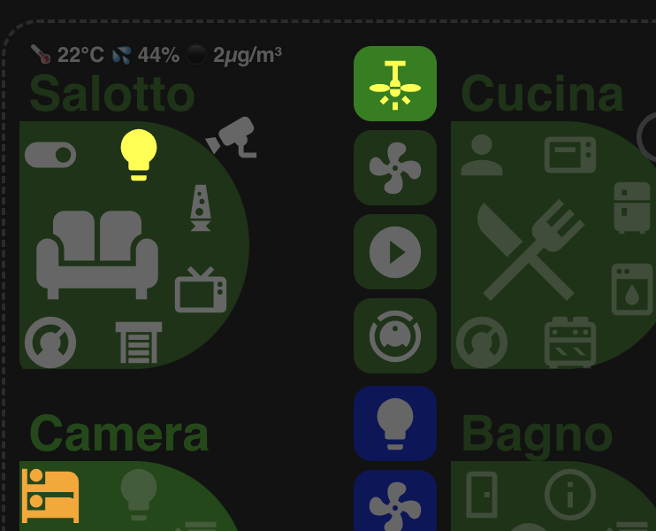

[](https://github.com/mon3y78/Lovelace-Bubble-room)
[](https://github.com/mon3y78/Lovelace-Bubble-room/stargazers)
[](https://community.home-assistant.io/t/bubble-room/856230?u=ipilla)
[](https://www.reddit.com/r/homeassistant/s/Qgz9acN7Mr)

# 🫧 Lovelace Bubble Room v5
---

## 🚀 Lovelace Bubble Room v5 is here!

Lovelace Bubble Room v5 brings a completely redesigned experience, keeping the original style but adding powerful new options and full modularity. 

⚠️ **Important note**: If you were using v4, you will need to **recreate the card from scratch**, since the internal structure has been rebuilt to provide better performance and more features.

---

## ✨ What’s new
- 🔄 **Code rewritten from scratch** → faster, more stable, easier to maintain.  
- 🧩 **Modular panels** → add and combine different sections around the main bubble.  
- 🎛️ **Advanced configuration** → each panel has its own filters, controls, and reset.  
- 🧹 **“Clear” and “Reset” buttons** → quickly reset filters and panel settings.  
- 🪄 **Smart auto-discovery** → automatically detects available entities.  
- 🖼️ **New glass design** → modern, elegant look that fits any dashboard.  

---

## 🧩 Available panels
Lovelace Bubble Room v5 introduces specialized panels that you can freely combine:  

- **🎛️ Sub-Button Panel** → up to 4 additional buttons around the bubble, each with entity, icon, and customizable actions.  
- **🍄 Mushroom Panel** → up to 5 extra entities (lights, switches, media players, etc.) for quick access.  
- **📊 Sensor Panel** → up to 5 sensors (temperature, energy, battery, etc.) with **integrated history graph**.  
- **🎨 Color Panel** → RGB and color temperature controls with dedicated sliders.  
- **📷 Camera Panel** → display live camera feeds.  
- **🌡️ Climate Panel** → control climate devices with target temperature and modes.  
- **👁️ Room Panel** → presence/occupancy management with binary_sensor support and multiple filters.  

---

## 🚀 Why upgrade to v5?
- More **powerful** → complete dashboards around a single bubble.  
- More **user-friendly** → auto-discovery, filters, clear and reset buttons.  
- More **beautiful** → modern glass design for stylish dashboards.  

---

## ⚠️ Migration from v4
This is a **major release** and not compatible with v4.  
👉 You will need to **recreate your card from scratch** to take full advantage of the new features.  

---

## Community & Support

For discussions, feedback and support, visit the official thread on the Home Assistant Community Forum:

🔗 [Bubble Room - Home Assistant Community](https://community.home-assistant.io/t/bubble-room/856230?u=ipilla)

# 📥 Installation
## Via HACS
1. Go to HACS > Frontend.
2. Click on "Explore & Add Repositories" and add the Bubble Room GitHub repository.
3. Install the card and add the following resource in Lovelace if HACS does not add it automatically:
   ```yaml
   url: /hacsfiles/Lovelace-Bubble-room/lovelace-bubble-room.js
   type: module
   ```

# Development

```bash
npm install
npm test
npm run build
```
